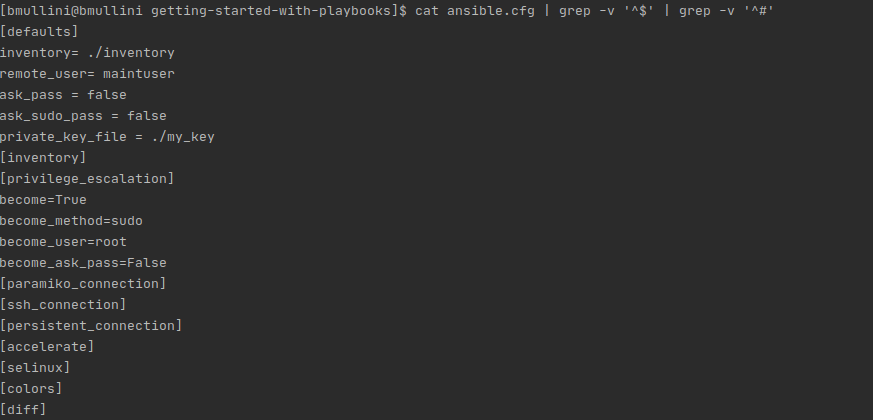

# Working with Ansible Playbooks

Last updated: 06.12.2020

## Purpose

The purpose of this document is to show how to work with Ansible playbooks.

## Prerequisites

Please read the instructions in the [readme.md](../readme.md)
to have an understanding of how to set up your Ansible environment
and run adhoc Ansible commands before continuing.

Please setup your environment if you don't have access to Ansible by
following the instructions [here](../readme.md).

### A Running VM

You can create your VM anyway you want.  

One option is to use Terraform to create an Amazon EC2 instance (VM).
I have instructions on setting up your environment in the
[terraform for beginners git repo](https://github.com/bretmullinix/terraform-for-beginners).
In the repo be sure to follow the instructions in the
[readme.md](https://github.com/bretmullinix/terraform-for-beginners/blob/master/readme.md)
and the instructions in the
[ about how to inject your private key into an ec2 instance](https://github.com/bretmullinix/terraform-for-beginners/tree/master/injecting-your-ssh-key-into-ec2-instance).

### Instructions

1. Open up a terminal.
1. mkdir getting-started-with-playbooks
1. cd getting-started-with-playbooks
1. Copy the content [here](../getting-started) to the current directory.
1. Run `tree` in your terminal.  You should see the following output:

    

    The output of the **tree** command is the following:
    
    - **ansible.cfg**: The ansible configuration file used to configure
    the location of your inventory and other preferences for your playbook(s)
    in the current directory and below.
    - **inventory**: The directory contains all the inventory files.
     The inventory files define the servers and/or groups
     that can be a target for your playbook(s)
    
1.  Run `cat ansible.cfg | grep -v '^$' | grep -v '^#'`.  You will get
the following output:

    

    The active configuration is explained below:
    
      - **inventory** = Currently, the value specifies the inventory directory to
        find all the inventory files.  If you had more than one
        inventory file, you could add them to this directory and ansible
        would allow you to specify any server or group(s)
        listed in any of the files.
        
      - **remote_user** = The user on the remote machine you
        plan to login as using ssh.
        
      - **ask_user** = If set to true, before you run an ansible command(s),
        the ansible program will prompt you for a password.  Since we are going to
        be using a private key file, we won't need a password prompt on ssh
        login.
        
      - **ask_sudo_pass** = If set to true, before any privileged ansible
        command(s) can be run, the ansible program
        will prompt you for a password. If your user requires a
        password when running a **sudo** command, 
        you will need to set this to true.
        
      - **private_key_file** = The private key file that is used to login using
        ssh.

1. Copy your **my_key** private key file for your vm to this directory.
1. Edit the **./inventory/my_first_inventory** file and change the ip to
correspond to the ip of your VM.
1. Create a file called **my-first-playbook.yml**
1. Add the following content to the file:

    ```yaml
   ---
   - name: My First Playbook
     hosts: all
     tasks:
     - name: Print the Running Users Id
       command:
         args: id
     - name: Install the Apache HTTP Server
       yum:
         name: httpd
         state: present
   ```
   
   The definition of the above **playbook**:
   
   - **\- name: My First Playbook**: The name of your playbook.
   
   - **hosts: all**: The **all** group of servers to run the playbook
    against. The **all** group is defined in the
    **./inventory/my_first_inventory** file.
   
   - **tasks** : Marking the start of defining **tasks**.  A **task**
   is a definition of the name of the task (optional), the module to run,
   and the required arguments for the module.

   - The first task runs the **command** module with the argument **id**.
   The module **command** is used to run any arbitrary command(s) listed
   in the arguments section, in this case the **id** command is run.
   
   - The second task runs the **yum** module with the arguments 
   **name:  httpd** and **state: present**.  The **yum** module looks for
   the package listed under the **name** argument and installs the package
   if the package is not installed.  Otherwise, the **yum** module does nothing
   to the target server(s).
   
1. Run ` ansible-playbook --syntax-check my-first-playbook.yaml` to make
sure your ansible playbook is syntactically correct.  You may add **-v**,
**-vv**, **-vvv**, or **-vvvv** to show more and more detailed output for
debugging.

1. Run `ansible-playbook my-first-playbook.yaml` to run the playbook.  The
playbook will check the **id** of the logged in user on the server(s) and then
install **httpd** if it does not exist.  You may add **-v**, **-vv**, **-vvv**,
or **-vvvv** to show more and more detailed output for debugging.


